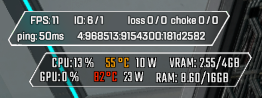
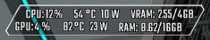

# RTSS-Overlays
My Rivatuner Statistics Server overlays for various games.

### Usage

#### Font
1. Open RTSS and under `On-Screen Display rendering mode` click `Raster 3D` to load the font.

#### Overlay
1. Place .ovl (and .png) in `C:\Program Files (x86)\RivaTuner Statistics Server\Plugins\Client\Overlays`

2. Open RTSS and go to `Setup > Plugins` and double click `OverlayEditor.dll` to load the file.

## Previews

### Apex Legends

#### Colored

#### White

